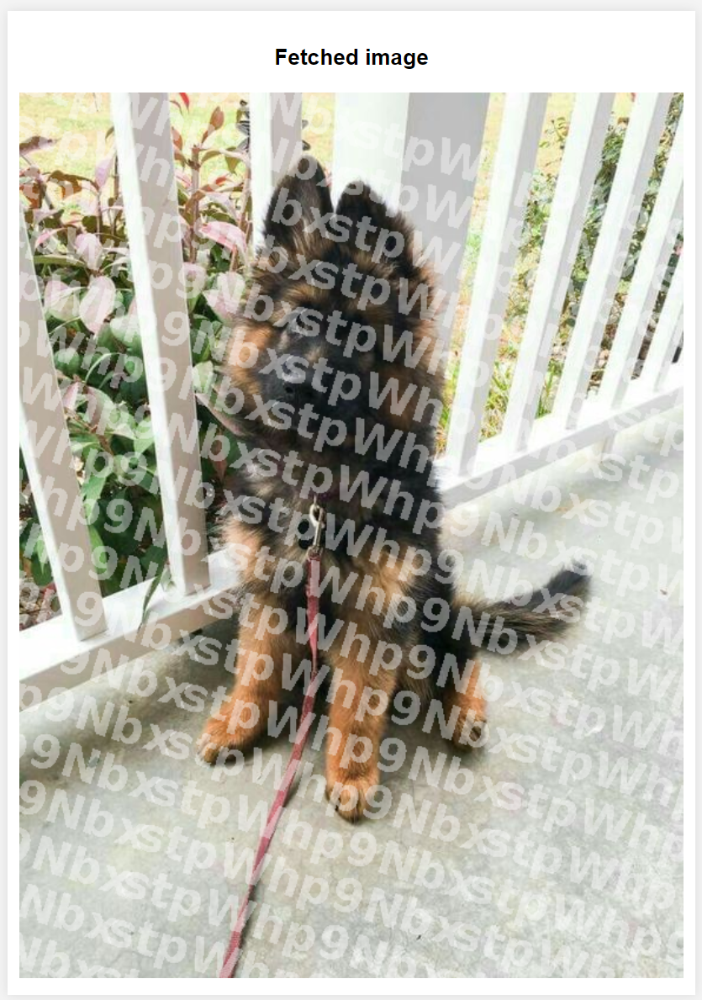

## Image Marking System

 

<p align="center">
     
</p>

System marking images by user code.

## Diagram

<p align="center">
     
</p>

## Architecture

System contains 5 containers:

### system-client

Web client in ReactJS technology with features:
- Register user.
- Upload new image.
- Download marked image.

### system-database

MongoDB with 2 collections:
- Registered users
- Uploaded images


### system-storage

Ktor service communicating other services with database by private-API.

### user-register

Ktor service registering users and assign to them special code.

### image-marker

Ktor service marking images by users private code.


## Build docker containers

```docker
docker compose up
```

## Preview

<p align="center">
     
</p>


<p align="center">
     
</p>
